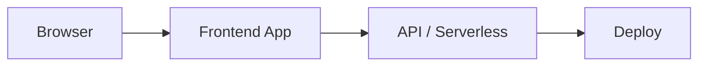

# Vidya Raut - Portfolio Website

<div align="center">


**A 2026-ready multilingual portfolio built on Next.js 16, React 19, App Router i18n, and a multi-agent chat architecture with optional FastAPI support.**

[🌐 Live Demo](https://mangeshraut712.github.io/vidyaraut/) | [📧 Contact](mailto:vidyaraut17297@gmail.com) | [💼 LinkedIn](https://www.linkedin.com/in/vidyaraut17/) | [🤖 GitHub](https://github.com/mangeshraut712/vidyaraut)

</div>

---

## ✨ Key Features

### 🎨 Premium Product Experience
- **Solid Theme System** - Clean white light mode and true black dark mode
- **Editorial Layout Rhythm** - Consistent section spacing, heading alignment, and surface styling
- **Homepage-First Flow** - Main story lives on one strong landing page instead of fragmented pages
- **Refined Footer & Navigation** - Cleaner information architecture and better CTA placement

### 💬 AI Agent Desk
- **Four Specialized Agents** - Portfolio Guide, Energy Market Agent, Opportunity Advisor, and Puzzle Helper
- **Stable Chat Shell** - Fixed-position chatbot with consistent sizing across agent switches
- **Quick Actions & Copy Support** - Faster interaction paths for common questions
- **Free Browser Dictation** - Native microphone-based text input without extra service cost

### 🧩 Interactive Game Flow
- **Inline Crossword Section** - Game lives below contact on the homepage
- **Puzzle Helper Integration** - Paste clues directly into the chatbot or helper box
- **No Forced New Tab Experience** - `/[locale]/game` redirects back to the homepage `#game` section

### 🌐 Internationalization
- **3 Languages** - English, Hindi (हिंदी), Marathi (मराठी)
- **Locale-Aware Routing** - `/en`, `/hi`, `/mr`
- **Shared Content Structure** - Same app shell and major flows across locales

### 🚀 Deployment-Ready Architecture
- **Next.js 16 App Router** - Modern routing and rendering model
- **Optional FastAPI Backend** - Supports chat proxying and separate Python deployment
- **Remote Upstream Fallback** - FastAPI and Next.js can proxy chat when local provider keys are not set
- **GitHub Pages** - Static export (`output: 'export'`) at `/vidyaraut/`

### 🧱 2026 Platform Foundation
- **Next.js 16 Generation** - App Router, route handlers, metadata, and modern production output
- **React 19 Runtime** - Current React stack with modern hook and compiler-era support
- **React Compiler Support** - Enabled through the Next.js toolchain for a cleaner component model
- **next-intl 4.x App Router i18n** - Locale-aware routing aligned to the current Next.js i18n ecosystem
- **OpenAI Responses API Alignment** - Chat architecture is built around the newer Responses path, with layered fallback behavior

---

## 🛠️ Tech Stack

| Category | Technology | Version / Notes |
|----------|------------|-----------------|
| **Framework** | Next.js App Router | 16.1.x |
| **UI Library** | React | 19.2.x |
| **React Compiler** | Next.js integrated support | enabled |
| **Language** | TypeScript | 5.7.x |
| **Styling** | Tailwind CSS | 3.4.x |
| **Animations** | Framer Motion | 11.x |
| **i18n** | next-intl | 4.5.x |
| **Theme** | next-themes | 0.4.x |
| **Routing / Locale Flow** | App Router + next-intl (no middleware; static export) | locale-aware |
| **Forms / Validation** | react-hook-form + Zod | 7.x / 3.x |
| **UI Primitives** | Radix UI | multiple packages |
| **State / Helpers** | Zustand, CVA, clsx | lightweight usage |
| **Backend (optional)** | FastAPI + httpx + uvicorn | Python service |
| **AI Layer** | OpenAI Responses API + OpenRouter fallback | multi-provider support |
| **CI** | GitHub Actions | `.github/workflows/ci.yml` |
| **Deployment** | GitHub Pages | `output: 'export'` + `.github/workflows/pages.yml` |

---

## 📁 Project Structure

```text
vidyaraut/
├── .github/
│   └── workflows/
│       ├── ci.yml                 # GitHub Actions checks
│       └── pages.yml              # GitHub Pages static deploy
├── api/
│   └── index.py                   # Python entrypoint wrapper
├── fastapi_backend/
│   ├── __init__.py
│   └── main.py                    # Optional FastAPI backend
├── public/
│   ├── logo.png
│   ├── home picture.jpeg
│   ├── manifest.json
│   ├── robots.txt
│   └── Vidya_Raut_Resume.md
├── scripts/
│   ├── run-clean.mjs              # Safe clean + run helper
│   └── type-check.mjs             # Route-aware TS checks
├── src/
│   ├── app/
│   │   ├── [locale]/
│   │   │   ├── page.tsx           # Main homepage flow
│   │   │   ├── layout.tsx         # Locale layout
│   │   │   ├── skills/
│   │   │   ├── projects/
│   │   │   ├── certifications/
│   │   │   └── game/              # Redirects to #game
│   │   ├── globals.css            # Theme tokens + shared surfaces
│   │   ├── layout.tsx             # Root metadata + app shell
│   │   ├── page.tsx               # Root locale redirect
│   │   ├── providers.tsx
│   │   └── sitemap.ts
│   ├── components/
│   │   ├── AIChatbot.tsx
│   │   ├── Footer.tsx
│   │   ├── Game.tsx
│   │   ├── GlobalLayout.tsx
│   │   ├── Navigation.tsx
│   │   ├── PageBackButton.tsx
│   │   ├── ScrollToTop.tsx
│   │   ├── SectionIntro.tsx
│   │   ├── Timeline.tsx
│   │   └── ui/
│   ├── i18n/
│   │   ├── config.ts
│   │   ├── request.ts
│   │   ├── routing.ts
│   │   └── messages/
│   ├── lib/
│   │   ├── assistant-agents.ts
│   │   ├── collection-utils.ts
│   │   ├── data.ts
│   │   ├── legacy-data.ts
│   │   ├── openrouter.ts
│   │   ├── site.ts
│   │   └── utils.ts
│   ├── server/
│   │   └── chat-route.ts          # Optional Node chat handlers (not used on Pages)
│   └── types/
├── .env.example
├── next.config.ts
├── vercel.json
├── package.json
└── README.md
```

### Where To Find Things

- **Homepage narrative:** `src/app/[locale]/page.tsx`
- **Chatbot UI:** `src/components/AIChatbot.tsx`
- **Game section:** `src/components/Game.tsx`
- **Agent definitions:** `src/lib/assistant-agents.ts`
- **Optional Node chat handlers:** `src/server/chat-route.ts`
- **FastAPI backend:** `fastapi_backend/main.py`

---

## 🖼️ Visual Preview

Add project visuals here:

```text
docs/images/
```

Recommended files:

- `docs/images/homepage-light.png`
- `docs/images/homepage-dark.png`
- `docs/images/chatbot-demo.gif`
- `docs/images/game-section.png`
- `docs/images/projects-page.png`

Example usage:

```md


```

---

## 🚀 Getting Started

### Prerequisites

- **Node.js** 20 or higher
- **npm**
- **Python 3.11+** if you want the optional FastAPI backend

### Installation

```bash
# Clone the repository
git clone https://github.com/mangeshraut712/vidyaraut.git
cd vidyaraut

# Install frontend dependencies
npm install

# Create local env file
cp .env.example .env.local

# Start development server
npm run dev
```

Open:

- `http://localhost:3000/vidyaraut/en/`

Notes:

- `basePath` is `/vidyaraut`, matching GitHub Pages
- `npm run dev` uses the safer default local dev path
- `npm run dev:turbo` is available when you explicitly want Turbopack in development

### Optional FastAPI Backend

```bash
python3 -m venv .venv
source .venv/bin/activate
pip install -r requirements.txt
uvicorn fastapi_backend.main:app --reload --host 127.0.0.1 --port 8000
```

Open:

- `http://127.0.0.1:8000/health`

---

## 🔐 Environment Variables

Create `.env.local` from `.env.example`:

```env
NEXT_PUBLIC_SITE_URL=http://localhost:3000/vidyaraut
NEXT_PUBLIC_SITE_NAME=Vidya Raut Portfolio
NEXT_PUBLIC_CHAT_API_URL=

OPENAI_API_KEY=
OPENAI_MODEL=gpt-5.4

OPENROUTER_API_KEY=
OPENROUTER_MODEL=openai/gpt-3.5-turbo

FASTAPI_URL=
FASTAPI_INTERNAL_TOKEN=

CHAT_UPSTREAM_URL=
```

### Notes

- `OPENAI_API_KEY` is optional and is not used on the GitHub Pages static site
- `OPENROUTER_API_KEY` is optional and is not used on the GitHub Pages static site
- `NEXT_PUBLIC_CHAT_API_URL` is optional; when unset, the chatbot uses on-page fallback replies
- `FASTAPI_URL` is optional for a separately hosted Python backend
- `CHAT_UPSTREAM_URL` is optional for the unused Node chat handlers in `src/server/chat-route.ts`

---

## 💬 Usage Examples

The public GitHub Pages site has no `/api/chat` route. Chat on that site uses local fallback replies unless `NEXT_PUBLIC_CHAT_API_URL` points at a hosted backend.

Optional FastAPI health check:

```bash
curl http://127.0.0.1:8000/health
```

---

## 📝 Available Scripts

| Script | Description |
|--------|-------------|
| `npm run clean` | Remove build and cache artifacts |
| `npm run dev` | Start the safer default dev server |
| `npm run dev:turbo` | Start Turbopack dev mode explicitly |
| `npm run build` | Static export to `out/` |
| `npm run start` | Not used for GitHub Pages (`output: 'export'` has no Node server) |
| `npm run lint` | Run ESLint |
| `npm run lint:fix` | Auto-fix lint issues |
| `npm run type-check` | Run TypeScript route-aware checks |

---

## 🎨 Design System

### Theme Direction

**Light Mode**
- Background: Solid white
- Foreground: Slate/ink editorial contrast
- Primary: Clean blue emphasis

**Dark Mode**
- Background: Solid black
- Foreground: Warm near-white
- Primary: Bright blue emphasis

### Product Behavior

- centered headings for `skills`, `contact`, and `game`
- left-aligned headings for `projects`, `experience`, and `education`
- homepage-first story flow
- fixed chatbot shell below the navbar
- inline game instead of a separate normal page flow

---

## 🔄 GitHub Actions

CI workflow:

- `.github/workflows/ci.yml`

Checks included:

- `npm ci`
- `pip install -r requirements.txt`
- `npm run lint`
- `npm run type-check`
- `npm run build`
- Python compile validation for:
  - `api/index.py`
  - `fastapi_backend/main.py`

---

## 🌐 Deployment

### GitHub Pages (public site)

The public site is a Next.js static export on GitHub Pages:

- Live URL: https://mangeshraut712.github.io/vidyaraut/
- `output: 'export'`, `basePath: '/vidyaraut'`, `trailingSlash: true`
- Images use `images.unoptimized` (Pages has no Next image optimizer)
- Workflow: `.github/workflows/pages.yml` (`build_type=workflow`)

### Static-export blockers (intentionally not on Pages)

These server-only features cannot ship on GitHub Pages, so the public site uses the lightest static fallback instead:

| Blocker | Why it cannot export | Public-site fallback |
| --- | --- | --- |
| `src/app/api/chat/route.ts` (moved to `src/server/chat-route.ts`) | Route handlers need a Node server | Chatbot uses `getFallbackResponse()` unless `NEXT_PUBLIC_CHAT_API_URL` is set |
| `middleware.ts` / next-intl middleware | Middleware is not supported with `output: 'export'` | Root page client-redirects to `/en/` |
| `headers()` / `rewrites()` in `next.config.ts` | Not supported with static export | Dropped; GitHub Pages default headers only |
| Next.js Image Optimization | Requires the Next server | `images.unoptimized: true` |
| Live OpenAI / OpenRouter keys | Secrets cannot run in static JS | Optional self-hosted FastAPI + `NEXT_PUBLIC_CHAT_API_URL` |

`vercel.json` remains in the repo but the paused Vercel project is no longer the homepage.

### Optional FastAPI

1. Deploy FastAPI separately
2. Set provider keys on that service
3. Point the static site at it with `NEXT_PUBLIC_CHAT_API_URL`

---

## 🤝 Contributing

1. Branch from `main`
2. Keep changes small and consistent with the existing design system
3. Run:
   - `npm run lint`
   - `npm run type-check`
   - `npm run build`
4. If backend code changes, also run:
   - `./.venv/bin/python -m py_compile api/index.py fastapi_backend/main.py`
5. Update docs when routes, env vars, or behavior change
6. Open a pull request with screenshots/GIFs when UI changes

---

## 👩‍💼 About Vidya Raut

**Energy Technology & Market Analyst** with experience across:

- 📊 Market research and reporting
- 🔋 Energy storage systems and battery testing
- 📈 Excel and Power BI analysis
- 🧠 Domain translation for customers and decision-makers

This portfolio is optimized to help:

- recruiters understand role fit faster
- collaborators see project value clearly
- non-technical visitors understand energy-market work in plain language

### Contact

- 📧 **Email:** [vidyaraut17297@gmail.com](mailto:vidyaraut17297@gmail.com)
- 💼 **LinkedIn:** [linkedin.com/in/vidyaraut17](https://www.linkedin.com/in/vidyaraut17/)
- 🌐 **Portfolio:** [mangeshraut712.github.io/vidyaraut](https://mangeshraut712.github.io/vidyaraut/)

---

## 📄 License

This repository does not currently include a standalone `LICENSE` file.

Until one is added, treat the codebase as not licensed for general redistribution or reuse.

---

<div align="center">

**Built with Next.js 16, React 19, Tailwind CSS, and a multi-agent chat experience**

</div>

---

<!-- codex:project-diagram:start -->

## Project Diagram



_High-level flow of the deployed web experience and supporting services._

<!-- codex:project-diagram:end -->
